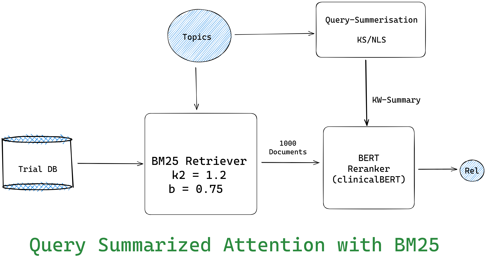

# TREC-CT_2022_QSA

Query Summarized Attention for TREC-CT 2022


# BM25
we need to install the elasticsearch package from your distro repo.
```sh
sudo systemctl start elasticsearch
python BM25.py
```
This will save the BM25.txt file in input folder.

# MonoBERT
## BERT architectures.

**BERT_CAT Architecture**

The query and document are passed together into the transformer
for semantic similarity.

To train the monobert model run,
```sh
python monobert.py
```
**BERT_DOT Architecture**

The Document and query embedding are produced separately and then dot 
product is done to get the relevance.

To train the colBERT model run,
```sh
python colbert.py
```

## BERT Models

- SciBERT - Finedtuned on Scintific text/literature
- BlueBERT - Finetuned on PubMed dataset
- BioClinicalBERT - Finetuned on MIMIC-III dataset

Change the model name in config file.

# Final Ranking
After the BERT reranking, we will consolidate all the scores. To do that run,
```sh
python output-consolidation.py
```

# Metric
The final re-ranked output is stored in output/final.txt
We can check the metric by running,
```sh
trec_eval -m "trec_official" input/qrels2022.txt output/final.txt
```
