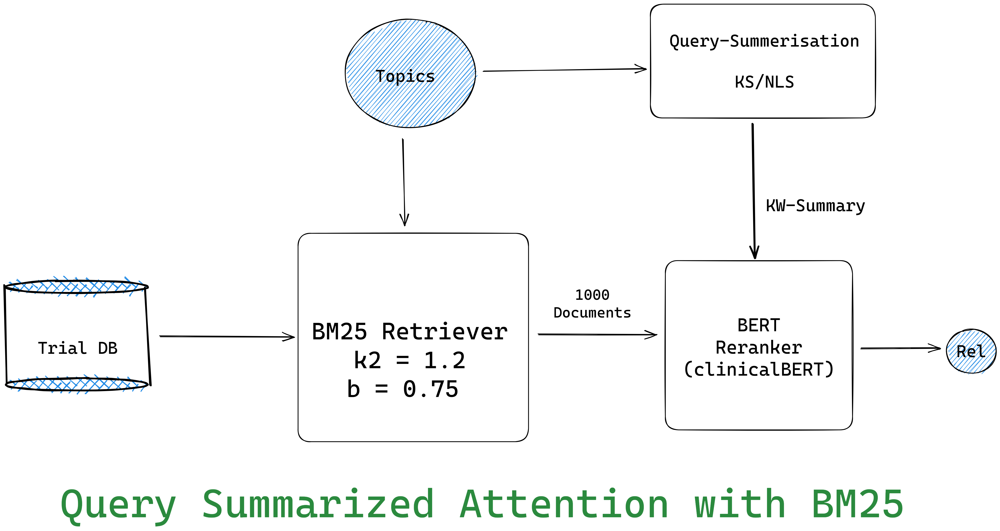

# Evaluation of Different Papers
Different metrics for different models implemented by the different teams in TREC CT 2022 track are as below.

| Papers/Model           | NDCG@10 | P@10   | RR     |
| ---------------------- | ------- | ------ | ------ |
| TREC Median            | 0.3922  | 0.2580 | 0.4114 |
| IKR3_BSL[^5]           | 0.4150  | 0.2820 | 0.5290 |
| jbnu2[^4]              | 0.4527  | 0.3220 | 0.5543 |
| senttr[^2]             | 0.4758  | 0.3540 | 0.5341 |
| monobert500[^1]        | 0.4912  | 0.3620 | 0.5273 |
| ims_BM25FilteredKW[^3] | 0.5500  | 0.3000 | 0.5000 |
| Ours                   | 0.3355 | 0.4100 | 0.6130 |
| frocchio_motot5_e      | 0.6125  | 0.5080 | -      |

Other approaches
| Approach | NDCG@10 | P@10  | RR |
| -------- | ------- | ----- | ---- |
| ColBERT(MS-MARCO)  | 0.1620  | 0.206 |0.37 |
| MonoBERT(Clinical)  | 0.3355  | 0.410 |0.6130 |

[^1]: [[CSIROmed (TREC 2022).pdf]]
[^2]: [[els_dshs (TREC 2022).pdf]]
[^3]: [[iiia-unipd (TREC 2022).pdf]]
[^4]: [[jbnu (TREC 2022).pdf]]
[^5]: [[UNIMIB (TREC 2022).pdf]]

# Approaches
## BM25 with Mono-Bert

## Query Summarization and Expansion

## Ours (Proposed Architecture)

